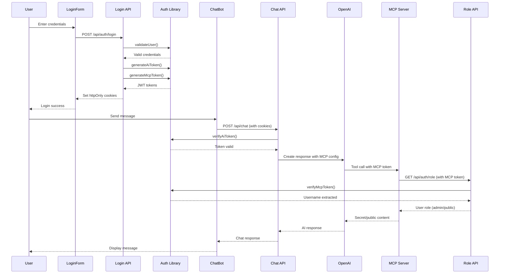

# Secret Elephant MCP Application

This application demonstrates a secure authentication and authorization system for AI-powered chat with MCP (Model Context Protocol) integration. The system features role-based access control with JWT tokens and secure MCP server communication.

## <� Architecture Overview

The application consists of two main components:

### 1. **Elephant AI** (`/elephantAi/`)
- **Next.js 15** frontend application with authentication UI
- **API routes** for authentication and chat functionality  
- **JWT token management** with separate AI and MCP tokens
- **Role-based access control** (admin vs public users)

### 2. **Elephant MCP Server** (`/elephantMcp/`)
- **MCP-compliant server** providing the `getSecretElephant` tool
- **Role verification** via callback to Elephant AI
- **Content access control** based on user permissions

## = Security Architecture

### Authentication Flow

### JWT Token Security

The application implements **dual-token architecture** for enhanced security:

#### AI Token (`ai_auth` cookie)
- **Purpose**: Authenticates user access to the AI chat interface
- **Secret**: `AI_JWT_SECRET` environment variable
- **Claims**: `{username, type: 'ai'}`
- **Usage**: Validated by [`verifyAiToken()`](elephantAi/src/lib/auth.ts:54-66) in chat API

#### MCP Token (`mcp_auth` cookie)  
- **Purpose**: Authenticates MCP server access and role verification
- **Secret**: `MCP_JWT_SECRET` environment variable
- **Claims**: `{username, type: 'mcp'}`
- **Usage**: Forwarded to OpenAI, validated by [`verifyMcpToken()`](elephantAi/src/lib/auth.ts:68-80)

### Cookie Security Configuration
- **httpOnly**: Prevents XSS access to tokens
- **secure**: HTTPS-only in production
- **maxAge**: 24-hour expiration
- **path**: Global scope (`/`)

## = Authentication Implementation

### User Management
Hardcoded users in [`auth.ts`](elephantAi/src/lib/auth.ts:11-25):
- **admin**: Full access to secret elephant data
- **public**: Limited access to public elephant data  
- **Passwords**: bcrypt hashed with salt rounds of 10

### Login Process
1. **Frontend**: [`LoginForm.tsx`](elephantAi/src/components/LoginForm.tsx:23-29) submits credentials
2. **API**: [`/api/auth/login`](elephantAi/src/app/api/auth/login/route.ts:15-17) validates user
3. **Token Generation**: Creates both AI and MCP tokens simultaneously
4. **Cookie Setting**: Stores tokens in httpOnly cookies

### Chat Authentication
1. **Token Verification**: [`/api/chat`](elephantAi/src/app/api/chat/route.ts:11-25) validates AI token
2. **MCP Forwarding**: MCP token sent to OpenAI in Authorization header
3. **Error Handling**: 401 responses trigger login redirect

## =� MCP Server Authorization

### Role Verification Flow
The MCP server implements a **callback verification pattern**:

1. **Token Extraction**: MCP server extracts JWT from `Authorization: Bearer <token>`
2. **Role Check**: [`checkUserRole()`](elephantMcp/api/server.ts:5-27) calls AI server's role endpoint
3. **Content Selection**: Serves appropriate content based on role

### Role API Endpoint
[`/api/auth/role`](elephantAi/src/app/api/auth/role/route.ts) provides role information:
- **Input**: MCP token via cookie
- **Process**: Validates token and extracts username
- **Output**: `{role: 'admin'|'public', username, isAdmin}`

### Content Access Control
- **Admin users**: Access to [`secretElephant.md`](elephantMcp/secretElephant.md) (contains "MRAWESOME")
- **Public users**: Access to [`publicElephant.md`](elephantMcp/publicElephant.md) (contains "frank")
- **Failed auth**: Defaults to public access

## =
 Security Analysis

### Strengths
 **Dual-token separation** prevents token misuse  
 **httpOnly cookies** mitigate XSS attacks  
 **JWT signature verification** ensures token integrity  
 **Role-based access control** enforces data segregation  
 **Callback verification** validates MCP requests  
 **bcrypt password hashing** protects credentials  

### Security Considerations
� **Hardcoded users** - Production should use database  
� **Environment secrets** - Ensure `AI_JWT_SECRET` and `MCP_JWT_SECRET` are cryptographically secure  
� **HTTPS requirement** - Secure cookies require HTTPS in production  
� **Token rotation** - No mechanism for token refresh/rotation  
� **Rate limiting** - No protection against brute force attacks  

## =� Key Files Reference

### Authentication Core
- [`elephantAi/src/lib/auth.ts`](elephantAi/src/lib/auth.ts) - Core authentication logic
- [`elephantAi/src/app/api/auth/login/route.ts`](elephantAi/src/app/api/auth/login/route.ts) - Login endpoint
- [`elephantAi/src/app/api/auth/role/route.ts`](elephantAi/src/app/api/auth/role/route.ts) - Role verification endpoint

### Chat Implementation  
- [`elephantAi/src/app/api/chat/route.ts`](elephantAi/src/app/api/chat/route.ts) - Chat API with MCP integration
- [`elephantAi/src/components/ChatBot.tsx`](elephantAi/src/components/ChatBot.tsx) - Chat UI component

### MCP Server
- [`elephantMcp/api/server.ts`](elephantMcp/api/server.ts) - MCP server with role-based content access

### Frontend Components
- [`elephantAi/src/components/LoginForm.tsx`](elephantAi/src/components/LoginForm.tsx) - Authentication UI

## >� Testing Credentials

For security auditing purposes:
- **Username**: `admin` / **Password**: `process.env.USER_PASSWORD || 'password'` (access to secret content)
- **Username**: `public` / **Password**: `process.env.USER_PASSWORD || 'password'` (access to public content)

## = Production Security Checklist

- [ ] Replace hardcoded users with secure database
- [ ] Implement rate limiting on authentication endpoints  
- [ ] Add token refresh/rotation mechanism
- [ ] Use environment-specific JWT secrets
- [ ] Enable HTTPS with secure cookie settings
- [ ] Implement proper logging and monitoring
- [ ] Add input validation and sanitization
- [ ] Consider implementing 2FA for admin users